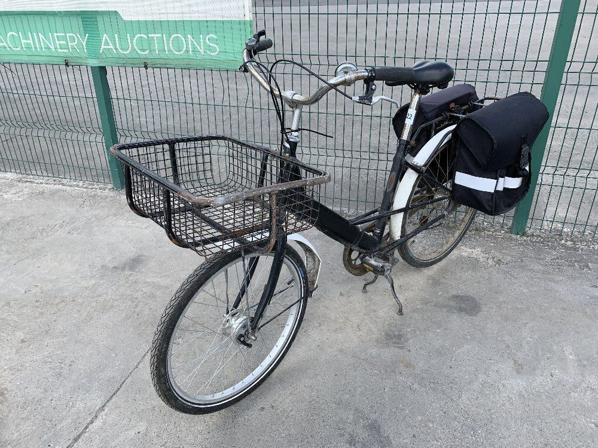
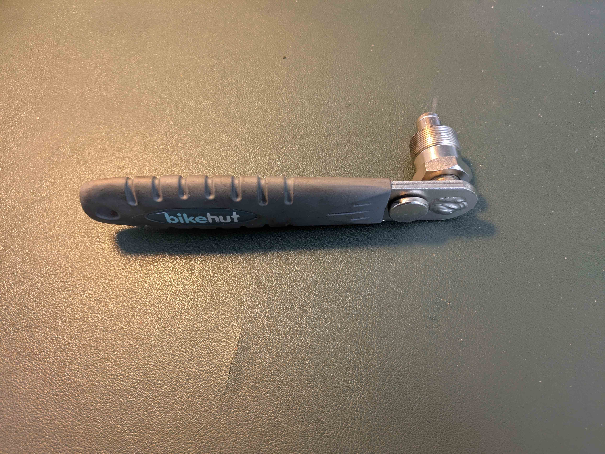
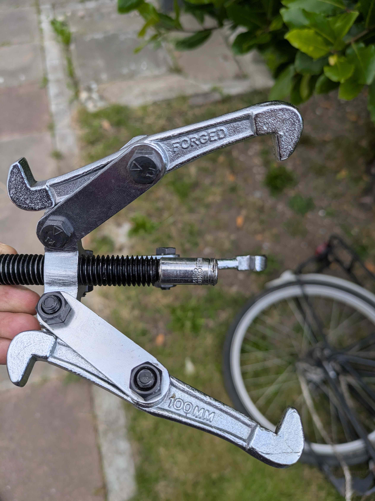
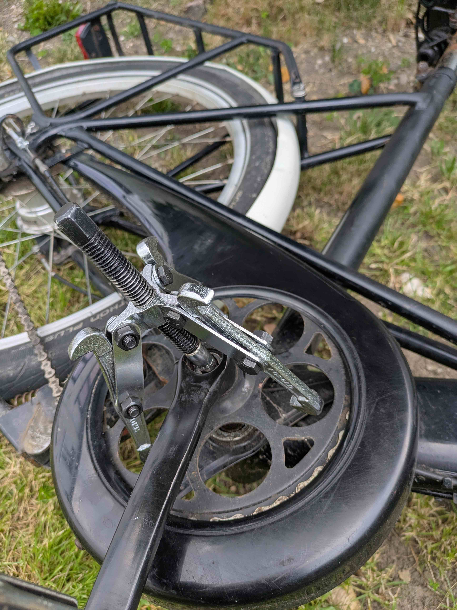
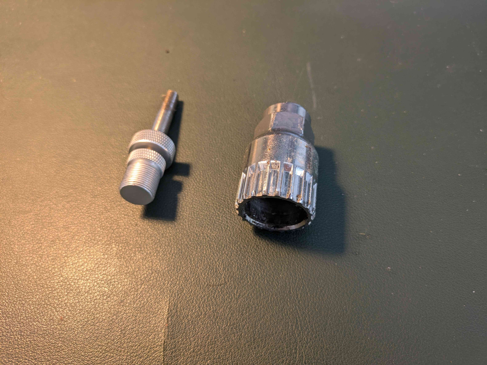
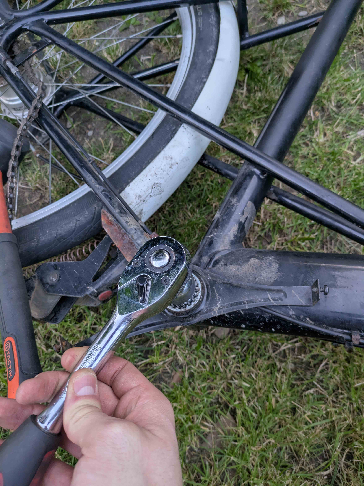

<figure>
    
    <figcaption>The Bike</figcaption>
</figure>

A little while back, I was in a minor accident while cycling my old 1970s Raleigh road bike that I [converted to electric](https://michael.mcand.ru/posts/chain-slip.html). While I came out unscathed, the bike didn't. The frame was completely mangled in the crash, and at least one of the rims was bent beyond immediate economical repair. If I ever find myself with an abundance of time, perhaps I will make an attempt at straightening it all out. But, for now I needed to find a new bike to transport me around the city.

**🚲 Choosing The Bike**

I have for the longest time wanted a [Pashley Mailstar/Pronto](https://www.pashley.co.uk/products/pronto). It's the cargo bike of choice for [the Royal Mail](https://www.royalmail.com/) and [An Post](https://www.anpost.com/). My mail is delivered by Mailstar every day. And, while certainly not the best-looking bike, there were several nice features that attracted me towards one, knowing that I would be fitting my [Bafang BBS02](https://www.pswpower.com/products/second-hand-44t-bafang-motor-48v-750w-bbs02b-with-p850c-display-and-brake-lever-352) (which thankfully survived the crash) to it:

- **Brakes that actually work:** The Pashley is a little over-braked because it's designed to carry a significant amount of cargo. Drum brakes are fitted front and rear to help with that. The Raleigh was significantly under-braked, even at its original weight, which made for a few especially frightening moments after fitting a 750W mid-drive motor to it. Rim brakes also suck even more on older bikes where you can never quite get the rims to be perfectly true. The brake pads make inconsistent contact with the rim, and reduce braking efficiency even more if that's even possible. Sealed brakes also don't suffer from becoming entirely useless at the first drop of rain.
- **Cargo-carrying capacity:** I use a bicycle as my main form of transport where I live in Dublin. The Raleigh prevented me from using the bike to get more than a few groceries that I could fit in my backpack. On one occasion, I cycled into town to buy a couple of new pillows, and had to strap one to each arm to get them home. Good protection in the event of a crash, but not particularly conducive to cycling. The Pashley is about as good as a bike can get for carrying cargo before having to step up to one of what we in Dublin inaffectionately call Ranelagh bikes. The Pashley seemed like a nice middle-ground for a cyclist used to riding a slim steel-framed vintage racer.
- **Centre Stand:** A must for the local postman running in and out of houses every 30 seconds, the centre stand is incredibly useful if you need to quickly run in to get something, and for performing maintenance on the bike. Not a deal-maker for me, but really nice to have all the same, and much preferable to a side stand.
- **Sturmey Archer Internal Gear Hub:** Most modern bicycles use an external freewheel or cassette with a derailleur to select the correct gear. These kinds of gearsets are lightweight and often have a lot of different ratios to choose from. However, they're a faff to adjust, need adjustment regularly, and are exposed to dirt and grime. An internal gearset like the Sturmey Archer on the Pashley is completely sealed, is super reliable, and rarely needs adjustment. It comes at the cost of weight, and they typically only have three ratios. This makes them a great choice for a commuter or post bike, but a poor choice for a stripped-out road bike. It also seems like a perfect pair for the Bafang mid-drive. The Sturmey Archer uses a Planetary gearset in a fascinating way that is certainly worthy of a future post in its own right.
- **Price:** It's hard to even get a new price on these bikes because they don't really seem to be stocked by many bike shops, but I think they're in the range of >£1,000 to buy new. However, you can find them at about one-fifth the price used online because people don't really want them. That's a hell of a lot of bike for very little money. And because they're built with really high-quality components, they'll last forever.

I picked up a bike for a decent price on [DoneDeal](https://www.donedeal.ie/). I believe it was at one stage an An Post bike judging from the colour and configuration. An Post opted for North Road handlebars, a specific front box, and a grey frame with white mudguards.

It was important to me to get a bike that was already in decent working order, and I would generally recommend the same to anyone undertaking an eBike conversion. There's enough work involved in the conversion that having to also restore the rest of the bike will slow you down, and could risk the project stalling and never getting finished.

In my case, even with the bike in good working order, I came across a few annoying blockers throughout the conversion process that I wouldn't have necessarily come across on a newer bike.

<figure>
    
    <figcaption>A similar Pashley Mailstar to my own</figcaption>
</figure>

**The Conversion**

A mid-drive conversion is, in my opinion, the most universally compatible conversion you can do. Mid-drive motors also typically have better torque than hub motors, brilliant for commuter bikes.

🧰 Tools Used

- Crank Puller
- 3-arm Puller
- Bottom Bracket Tool – 20-tooth for English thread
- Large Ratchet – for torque leverage
- Zip ties - for mounting various bits of the Bafang kit
- An assortment of screwdrivers and Alan keys

**1. Removing the crank arms**

The first step in a mid-drive conversion is removing the pedal assembly and crank arms. Typically, you'll need a crank puller to remove the crank arms on most bikes made after the 1970s. Pre-70s bikes are often [cottered](https://www.youtube.com/watch?v=E3qpm9-M17k). They use a cotter pin that has to be hammered out to remove the crank arm. They're nearly always seized and are a pain to remove.

Thankfully, the Pashley uses a standard M8 crank bolt, so I could use my crank puller. I've had a bikehut one for years and it works perfectly well. I recommend that you do your own research ahead of your conversion to determine how to remove the crank arms.

<figure>
    
    <figcaption>Crank Puller</figcaption>
</figure>

I removed the non-drive side fine, but the crank arm threads on the drive side were completely stripped. This meant that the crank puller couldn't get enough grip on the crank arm to pull it away from the bottom bracket.

The solution was to place the bike on the flat, and use a three-arm puller to pull the crank arm free. Importantly, I needed to sacrifice an 8mm socket by placing it at the end of the puller. An 8mm socket is the perfect size to push against the bottom bracket without fitting into the hole for the crank arm bolt.

I placed each arm of the puller around the crank arm sprocket, and tightened until it came free. It will likely require a lot of force to free the crank arm. You need to ensure that the puller is applying force as perpendicularly as possible to the crank arm so that it doesn't slip off. It may feel like you're about to break something, but most of the time this is normal.

I took this technique straight from [RJ the Bike Guy](https://www.youtube.com/watch?v=jrpIoXxVyTs) who has a brilliant video on this exact problem.

<figure>
    
    
    <figcaption>Removing the crank arm with a three-arm puller</figcaption>
</figure>

**2. Removing the bottom bracket**

The next challenge was to remove the bottom bracket from the bike. One of the joys of bicycles is that for things like bottom brackets and crank arms, there are many different "standards". Many of these require special tools to remove. [Park tool](https://www.parktool.com/en-int/blog/repair-help/bottom-bracket-standards-and-terminology) has a nice guide on the different standards. The Pashley uses an English threaded shell, and the bottom bracket requires a [20-tooth removal tool](https://www.amazon.ie/dp/B0DJ8N8K7C?ref=ppx_yo2ov_dt_b_fed_asin_title). It was incredibly difficult to get information on what tool I needed online. I think Pashley has used different bottom brackets over the years, so I chose to get the bike first, and then order the bottom bracket tool that I needed.

An important thing to note about English threaded shells is that the non-drive side uses a standard right-hand threading, but the drive side uses a left hand thread (righty loosy).

I ended up placing the bike on the flat, like what I did when removing the crank arm, attaching the largest ratchet I could find, placing a foot on top of the ratchet to make sure the tool wouldn't slip, and gave it a few whacks with my hand and it came loose. I found that there was very shallow tool engagement on the bottom bracket shell, which made applying pressure with a foot to the ratchet very important, and also a bit tricky.

My bottom bracket tool also came with a piece that threaded into the crank arm bolt thread to apply pressure to the tool for you. However, you can't use a ratchet when using the tool, and I didn't have a large enough spanner to fit around the tool, so I had to use the shoe method instead.

<figure>
    
    
    <figcaption>Removing the bottom bracket with a large ratchet</figcaption>
</figure>

**3. Fit the Bafang Motor Bottom Bracket**

There are lots of very good tutorials on [fitting a Bafang BBS02](https://www.youtube.com/watch?v=3Rjx1-RVDEc) so I won't cover that in detail. The main gist is that the Bafang uses a press fit shell, which means that it can be easily fitted to nearly any bicycle, including weird vintage bikes like my old Raleigh, or this Pashley.

Some things that I've learned about fitting the Bafang in my time are:

1. You need to tighten the locking nut very tight indeed. Over time, it will most likely come loose, and you'll notice some play in the motor when this happens. This is very normal for these motors though. Just torque it up again.
2. You need to have the speed sensor connected. The motor controller shuts down the motor after ~5 minutes if you don't. The speed sensor also needs to be placed very close to the magnet that you mount on the wheel spoke, otherwise it won't sense the speed.
3. You essentially need a display for it to work. You can technically run it without a display, but if you get a small, unintrusive display, you won't regret it.
4. The BBS02 has a maintenance-free nylon drive gear internally. However, this gear is easier to strip than a metal one, so I recommend choosing a lower gear when starting off on a hill to save wear on the gear.

**✅ Results**

I'm pretty happy with it! The bike itself is super easy to ride. Anyone from 5ft to 6ft 5 or even taller can comfortably ride it. The three-speed is perfect for around the city. It brakes significantly better than my old Raleigh ever did, and the extra cargo carrying ability is really useful. The weight is the biggest downside, but the BBS02 has more than enough power to compensate for it. Most importantly, the bike looks shabby enough that it is mostly safe from being stolen in Dublin. Like most cities, bike theft is pretty common here, so having a nice shiny new bike is asking for it to be stolen.

**🔮 Future Work**

I'm not quite done with it yet though. Some other bits that I'll be doing to it over the next while are:

- Upgrading from a 42-tooth to a 52-tooth front sprocket. For the speeds I can do on it now, the current sprocket is too low geared. I essentially never use first gear. I'll need a longer chain to facilitate the larger front sprocket.
- Better battery mounting: I have currently MacGyvered a battery mount with some zip ties, but it isn't really suitable. I'll probably drill some holes in the front and fit rivnuts to it, but I wanted to make sure that I was happy with the battery position first.
- Saddle: I have always dreamt of having a [Brooks saddle](https://www.brooksengland.com/en_uk/saddles.html). The current saddle is fine, but it's not the most comfortable for me. That said, I don't know if I'll actually get one because they do tend to be stolen in Dublin.

All in all, this Pashley conversion has been a rewarding project. The bike is comfortable, practical, and quirky in all the right ways. I’m looking forward to putting many miles on it—and not having to carry pillows strapped to my arms again.
