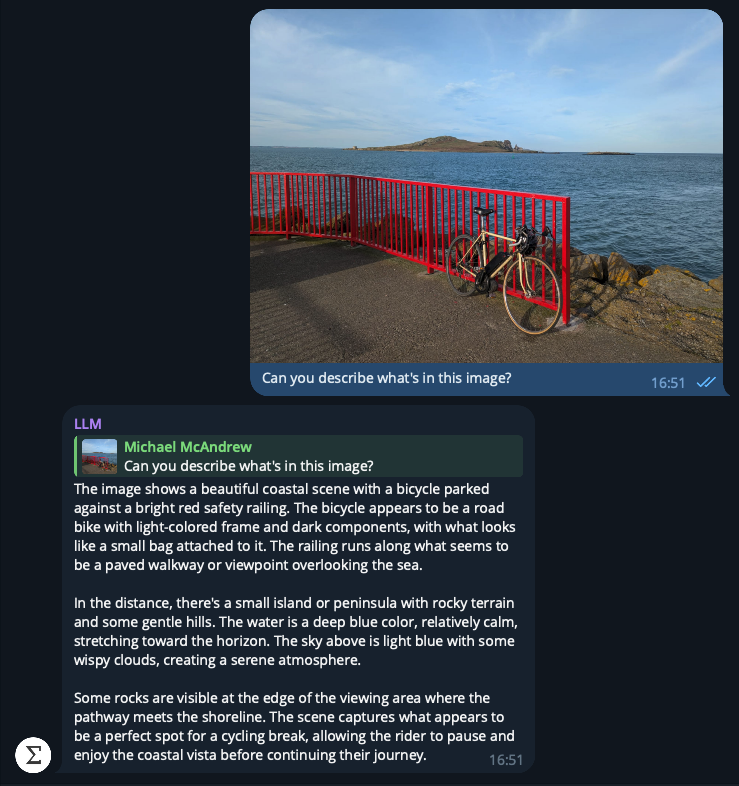
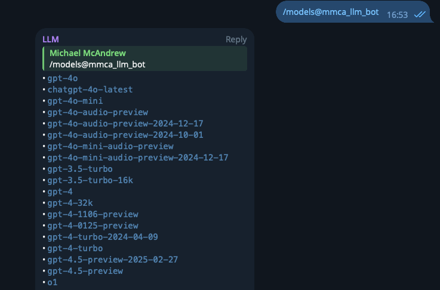
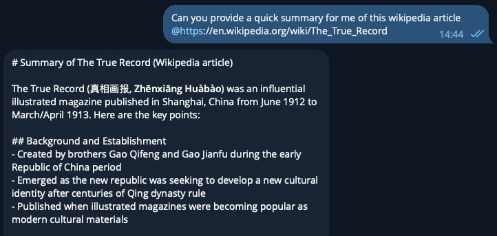
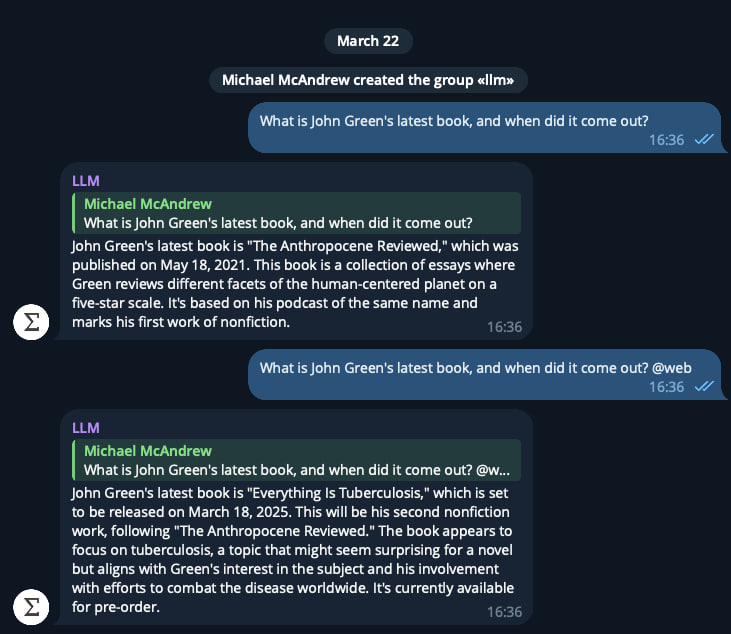

# Adding @ Symbols to my Telegram LLM Bot

I've been working on a Telegram bot called "LLM" for the past few weeks. Its interface is very similar to [ChatGPT](https://chatgpt.com/), [Claude](https://claude.ai/new), or [Gemini](https://gemini.google.com/app). You can start a conversation by creating a new Telegram group and adding the bot. From there, you can chat with it, attach images, audio clips (if the model supports them), videos, and files, and query them directly.

<figure>
    

    
    <figcaption>A multi-modal conversation with the Telegram bot</figcaption>
    

</figure>

This project is intended purely for my own learning, but it isn't just a complete clone of the major model provider chat tools. One difference is that it's model-agnostic. Right now, it supports models from Anthropic, OpenAI, and Google. You can pick whichever model best suits your conversation and even switch models mid-conversation if needed.

<figure>
    

    
    <figcaption>Listing the choice of available models to use</figcaption>
    

</figure>

I've found this especially useful for taking advantage of a multi-modal model for specific tasks. For instance, I recently needed to process some handwritten notes. I used Gemini to OCR the handwriting, since I find it performs best at that, and then switched to Claude Sonnet 3.7 to analyze and answer questions based on the extracted text.

This kind of "power user" feature isn’t necessary for most people, but I love using it in [Cursor](https://www.cursor.com/), so I wanted that same level of control on my phone too.

## @ Symbols

Speaking of Cursor, one of its standout power-user features is [@ Symbols](https://docs.cursor.com/context/@-symbols/overview). These are inline commands you can add to messages to guide the model’s response in a specific way.

### @link

One example is the `@link` command, which references a specific URL. You can use it like this:

> Can you summarise this Wikipedia article? @https://en.wikipedia.org/wiki/The_True_Record

Since this fits well with the "power user" theme, I thought it’d be a fun feature to add. It works by using regex to detect `@https://` text. For each URL, the bot scrapes the page using [Firecrawl](https://www.firecrawl.dev/), which conveniently returns the content in Markdown. I then pass that into the prompt context.

I like this pattern for cases where I need reliable information quickly and don’t want the LLM to hallucinate its answer. Often, I can find the exact source page I want it to use. Major model providers offer "web search" tools, but this method gives you more control.

<figure>
    

    
    <figcaption>Using @link to ask questions about a Wiki</figcaption>
    

</figure>

### @web

Speaking of web search, I also added an `@web` command. It works similarly to `@link` but performs a live search. The process is:

1. The bot detects the `@web` command in a message with regex.
2. It makes an LLM call to create a concise search query.
3. The query is executed using the [Brave Search API](https://brave.com/search/api/).
4. The results are added directly to the prompt context.

In this way, we're not leaving it up to the model
to decide to make a web search tool call, we're forcing the search results into the input
context, which gives us a bit more control, and increases the likelihood of the results
actually being correct.

<figure>
    

    
    <figcaption>Using @web to get John Green's actual most recent book</figcaption>
    

</figure>

I'm going to play around with these new `@` commands for a bit and see how useful they
are. I really ought to write a post with some more technical details about how the LLM
bot works too.
